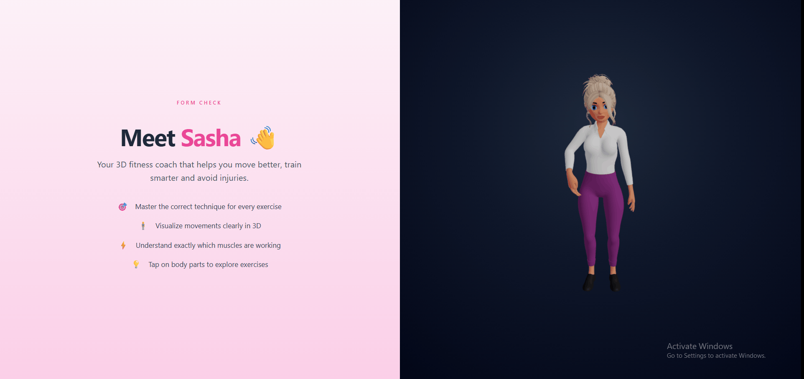
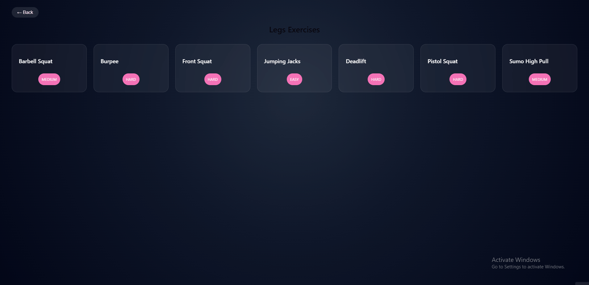

# 🏋️ FormLab

FormLab is a full-stack web application for learning proper exercise form through interactive 3D animations.

The application combines a Spring Boot backend with a React frontend and real-time 3D rendering using Three.js.

---

## 🚀 Features

- Browse exercises by body part  
- View exercise descriptions and difficulty levels  
- Play 3D animations for each exercise  
- Structured relational database with many-to-many relationships  

---

## 🛠️ Tech Stack

**Backend**
- Spring Boot
- JPA (Hibernate)
- REST API
- Liquibase (database migrations)

**Frontend**
- React
- React Three Fiber (Three.js)

**Database**
- PostgreSQL

**3D**
- Blender (model preparation and animation setup)
- Mixamo (animation sources)

---

## 🎮 3D System

A single `.glb` model contains multiple exercise animations.  
Animations are imported and combined in Blender and then dynamically triggered in the frontend based on backend data.

---

## 🎬 Preview

### 🏠 Home Page (Animation)


### 🏠 Home Page (UI)


### 🏋️ Exercises Page (Animation)


### 🏋️ Exercises Page (UI)


---

## ⚙️ Run the Project

### Backend
```bash
cd backend
./mvnw spring-boot:run
```


### Frontend
```bash
cd frontend
npm install npm run dev
```
